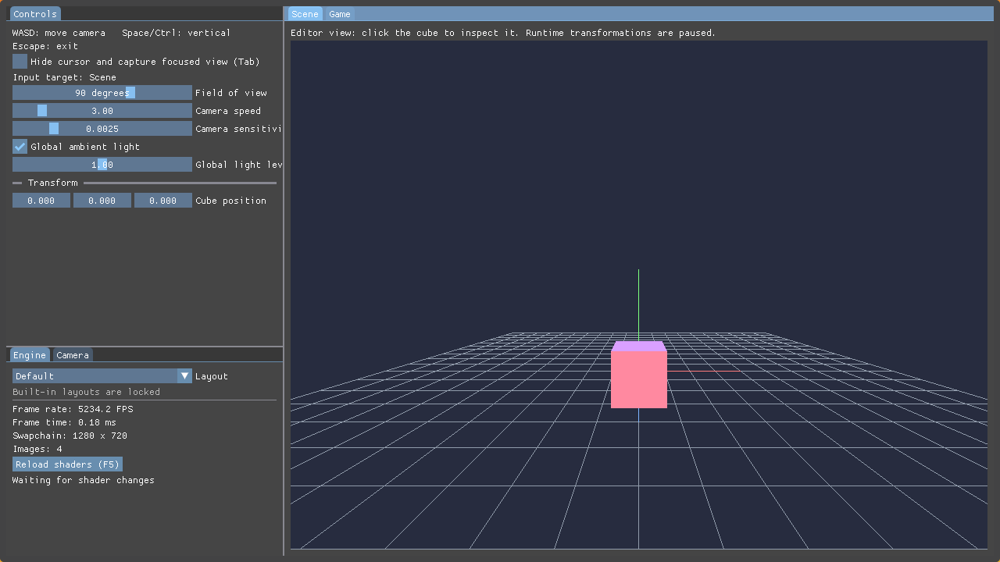
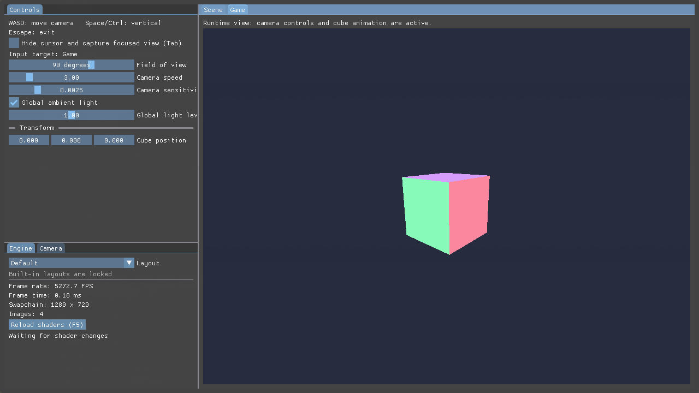

# 3D Game Engine

This is a 3D game engine written in C++ and GLSL using Vulkan, Dear ImGui, and GLFW. It currently renders a cube in separate scene and game views, with a grid in the scene view and cube animation in the game view. Both views have camera controls, and the interface lets you inspect the cube, change its position, adjust ambient lighting, and reload shaders while the engine is running. The math library is completely custom.

## Screenshots

### Scene view

### Game view

